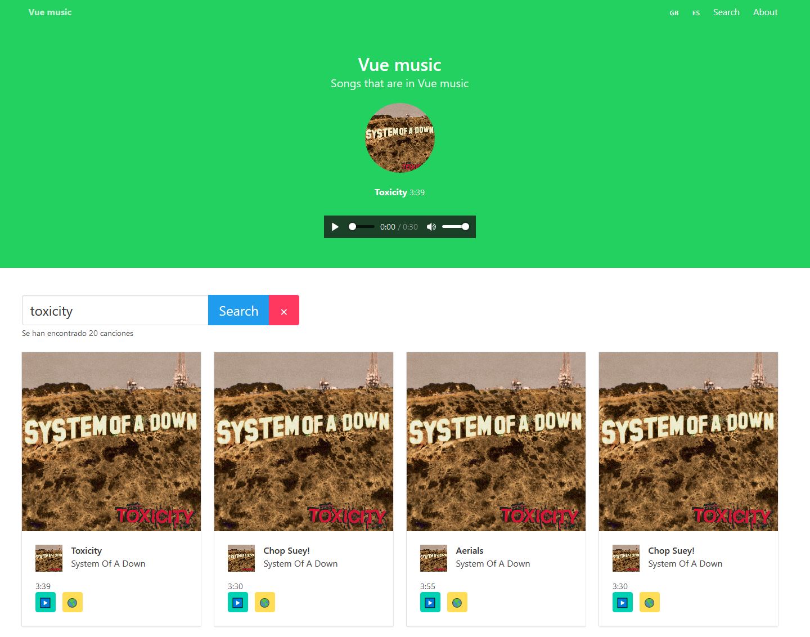

# vue-music

> Proyecto con fines educativos, aprendiendo a realizar una página web con Vue :)



## Herramientas y tecnologías utilizadas

- Vue.js
- Webpack
- Babel
- Eslint
- Sass
- Bulma
- Trae (librería)
- Vue router
- Vuex
- Vue-i8n

## Conceptos vistos

- Expresiones
- Directivas
- Data binding
- Propiedades computadas
- Watchers
- Eventos
- Fetch Api
- Librería trae
- Consumo Api REST
- Componentes
- Reactividad
- Comunicación entre componentes padres e hijos
- Comunicación entre componentes hijos hacia padres
- Slots
- Comunicación entre componentes genéricos (Event Bus y plugins)
- Vue router y router link
- Modificadores
- Filtros
- Directivas personalizadas
- Mixins
- Transiciones
- Vuex (state, mutations, getters y actions)
- Traducciones con vue-i18n

## Build setup

``` bash
# install dependencies
npm install

# serve with hot reload at localhost:8080
npm run dev

# build for production with minification
npm run build
```
